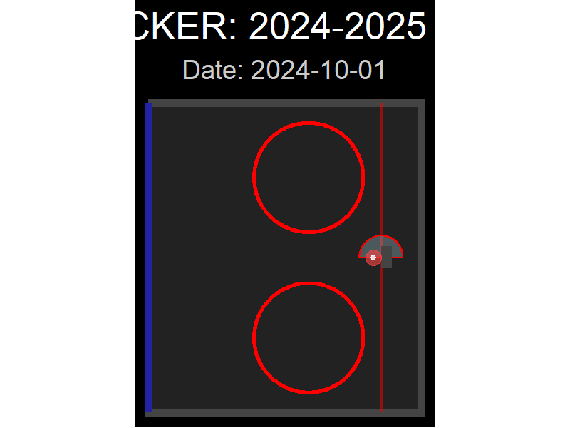

```{r, echo=FALSE, message=FALSE, warning=FALSE}
library(tidyverse)
library(gganimate)
library(ggforce)
library(gifski)

# 1. SETUP THE RINK
draw_rink <- function() {
  list(
    geom_rect(aes(xmin = 25, xmax = 100, ymin = -42.5, ymax = 42.5), 
              fill = "#222222", color = "#444444", linewidth = 2),
    geom_segment(aes(x = 25, xend = 25, y = -42.5, yend = 42.5), 
                 color = "blue", linewidth = 2, alpha = 0.5),
    geom_segment(aes(x = 89, xend = 89, y = -42.5, yend = 42.5), 
                 color = "red", linewidth = 1, alpha = 0.5),
    geom_arc_bar(aes(x0 = 89, y0 = 0, r0 = 0, r = 6, start = -pi/2, end = pi/2), 
                 fill = "lightblue", alpha = 0.3, color = "red"),
    geom_circle(aes(x0 = 69, y0 = 22, r = 15), color = "red", linewidth = 1, inherit.aes = FALSE),
    geom_circle(aes(x0 = 69, y0 = -22, r = 15), color = "red", linewidth = 1, inherit.aes = FALSE),
    geom_rect(aes(xmin = 89, xmax = 92, ymin = -3, ymax = 3), fill = "#444444")
  )
}

# 2. GENERATE DATA
set.seed(42)
n_goals <- 300
goals_data <- data.frame(
  Goal_ID = 1:n_goals,
  x = c(rnorm(n_goals * 0.7, mean = 80, sd = 5), rnorm(n_goals * 0.3, mean = 40, sd = 10)),
  y = rnorm(n_goals, mean = 0, sd = 12),
  Date = seq(as.Date("2024-10-01"), as.Date("2025-04-01"), length.out = n_goals)
)
goals_data$x <- pmin(pmax(goals_data$x, 26), 99)
goals_data$y <- pmin(pmax(goals_data$y, -41), 41)

# 3. BUILD ANIMATION (Optimized)
# Notice: We leave ggplot() empty and put data ONLY in geom_point
p <- ggplot() + 
  draw_rink() +
  
  # Data is only applied to the dots, not the rink lines
  geom_point(data = goals_data, aes(x = x, y = y), color = "#FF4444", alpha = 0.6, size = 4, stroke = 0) +
  geom_point(data = goals_data, aes(x = x, y = y), color = "white", alpha = 0.8, size = 1) + 
  
  coord_fixed() +
  theme_void() +
  theme(
    plot.background = element_rect(fill = "black"),
    text = element_text(color = "white", family = "sans"),
    plot.title = element_text(size = 20, face = "bold", hjust = 0.5),
    plot.subtitle = element_text(size = 14, color = "gray80", hjust = 0.5)
  ) +
  labs(title = "GOAL TRACKER: 2024-2025 CAMPAIGN",
       subtitle = "Date: {frame_time}") +
  
  # Animation commands
  transition_time(Date) +
  shadow_mark(alpha = 0.3, size = 4)

# 4. RENDER AND SAVE
anim_save("goal_heatmap.gif", 
          animate(p, nframes = 100, fps = 10, width = 800, height = 600, units = "px", renderer = gifski_renderer()))

# 5. DISPLAY

```
